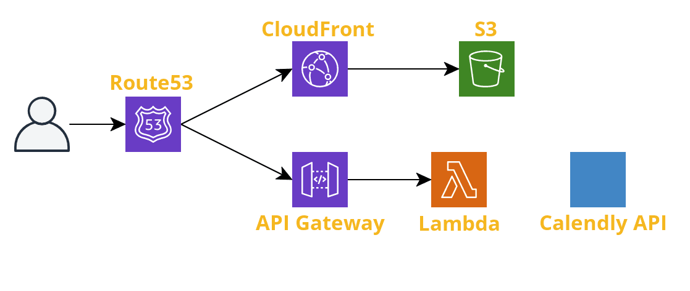

# Me
> My personal webite! https://hmm.dev

## Architecture

The DNS is hosted by Route53, then CloudFront serves the React bundle and all other static web assets. The API is an AWS Lambda running Node, triggered by an API Gateway event.

## Getting Started

This app uses [Lerna](https://lerna.js.org/) to make development easy. To run it locally:

1. Install root dependencies: `yarn`
2. Install web and API dependencies: `yarn bootstrap`
3. Run the app locally: `yarn start`
